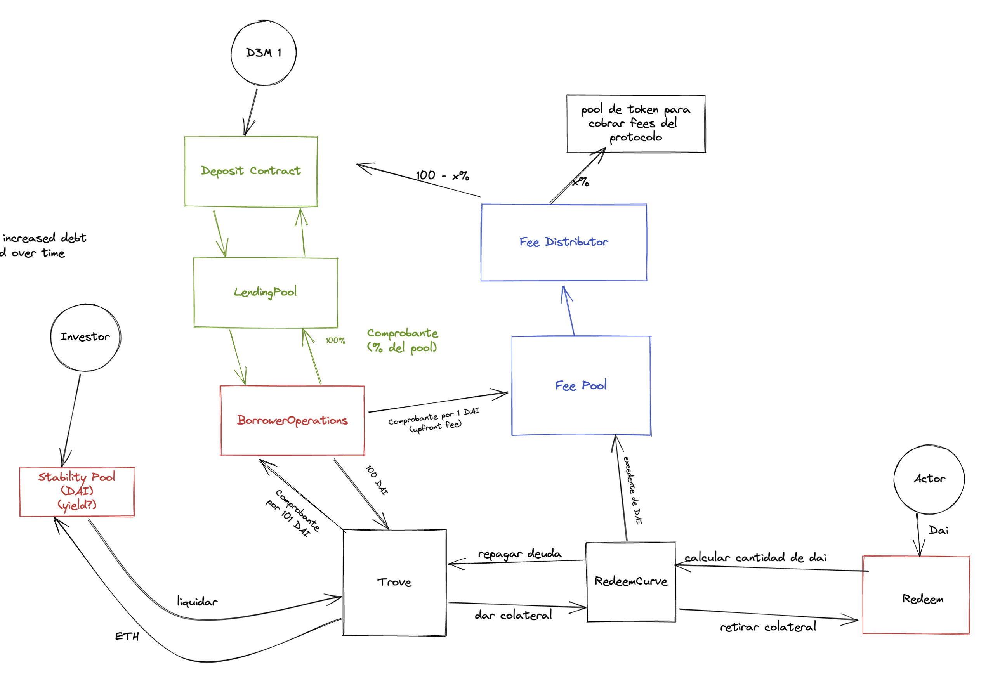

# SubMaker Liquity Fork

This project aims to extend Liquity's codebase in order to remove LUSD and replace it with DAI.

## Rationale
Maker's liquidation system is inefficient enough that the process of onboarding collateral types is both cumbersome and time consuming. Even after a collateral type is onboarded, liquidation ratios have to be set relatively high in order to provide enough incentives to borrowers to keep their positions afloat.
Liquity's system is more efficient in this regard, and can help mitigate some of Maker's liquidation system shortcomings.

## Structure
